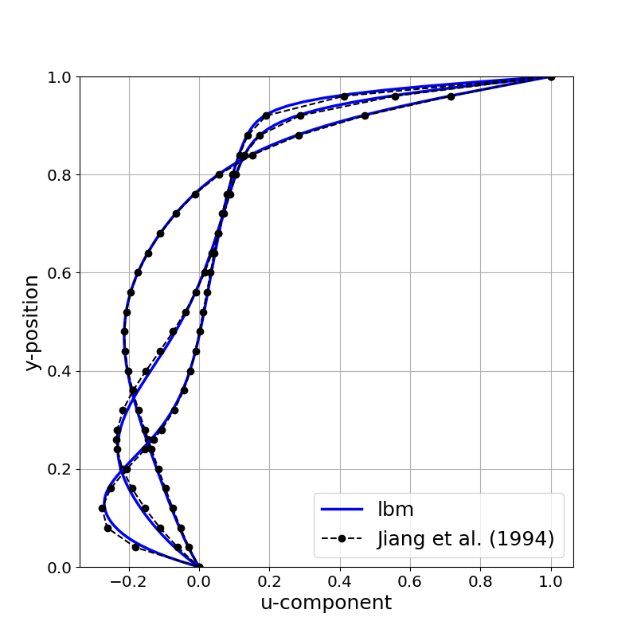

# lbm3d-kokkos
## Overview
lbm3d-kokkos is a C++ weakly compressible fluid flow solver written for CPUs or GPUs. The app is built on top of Sandia National Lab's performance portable Kokkos library. The majority of the app was written while attending a Kokkos workshop hosted by ORNL in July of 2018. Boundary conditions are specific to the 3D lid driven cavity. If you want something else, feel free to modify/extend the code.
## Build
```bash
mkdir proj
cd proj
git clone https://github.com/vasylivy/lbm3d-kokkos.git
```
Edit `lbmd3d-kokkos/lbm3d/Makefile` and set the device, architecture, and path for Kokkos. For example, setting `KOKKOS_DEVICES = OpenMP` and `KOKKOS_ARCH = SNB` will compile for Sandy Bridge Intel CPUs + OpenMP. Setting `KOKKOS_DEVICES = Cuda` and `KOKKOS_ARCH = SNB, Maxwell52`, will compile for a Sandy Bridge Intel CPU +  Nvidia GTX Titan X. A list of architecture flags, as well as other Kokkos compilation flags can be found [here](https://github.com/kokkos/kokkos/wiki/Compiling). The default Kokkos path is `KOKKOS_PATH = ../../Kokkos/kokkos`. While still in the proj directory, execute the following cmds to download Kokkos

```bash
mkdir Kokkos
cd Kokkos
git clone https://github.com/kokkos/kokkos.git
```
To build the executable

```bash
cd ../lbm3d-kokkos/lbm3d
mkdir release
make -j
```
The app will be compiled to the `release` directory as `lbm.host` or `lbm.cuda` depending on if it is an OpenMP or Cuda build.

## lattice Boltzmann method
The LBM implementation uses the BGK collision operator, D3Q19 quadrature for velocity space, and half-way bounce back for the boundary conditions. For collision-streaming, an A-B pattern is used. That is 19 distriubtions are read from array A, collided, and then streamed to array B. After applying boundary conditions, pointers to the arrays are then swapped. This collision-streaming pattern requires 2x the memory storage but is easy to implement. Details and further references regarding LBM can be found in Kruger's et al. text [[1]](https://link.springer.com/content/pdf/10.1007/978-3-319-44649-3.pdf).

## Running the 3D lid driven cavity
After compilation, execute the cmds

```bash
cd lbm3d-kokkos/cavity3d
./run.sh
```
The app outputs macroscopic variables to `cavity3d/output/` as `.bin` files based on the specified output rate until steady state is reached or the number of maximum steps is exceeded. To plot and compare the u velocity component to Jiang et al. results use the provided python script `scripts/plot.py`

```bash
python3 ../scripts/plot.py -reynolds 100 400 1000 -nx 128 -ny 128 -nz 128 -umax 0.1
```
The python scripts assumes the `output` for a desired Reynolds number has been moved to its own directory. For `Re=100` with a domain size of `128x128x128`, the output should be moved to a directory `re100_128x128x128`. By default, a row major (C/C++) data format is assumed. An optional `-cuda 1` flag can be passed to specify column-major (Cuda/Fortran) data format.

## Validation
As the name suggests, the lid driven cavity is an enclosed flow driven by the movement of a lid. Here, the lid velocity is set to only have the x-component. Below a critical Reynolds number, the flow is steady. Figures below compare the horizontal component of velocity at the vertical centerline for different Reynolds numbers (`Re = 100, 400, 1000`) against Jiang et al. (1994) least-square FEM results. The LBM simulations use a spatial resolution of `126x126x126`.
<p align="center">
  
</p>

## Performance
